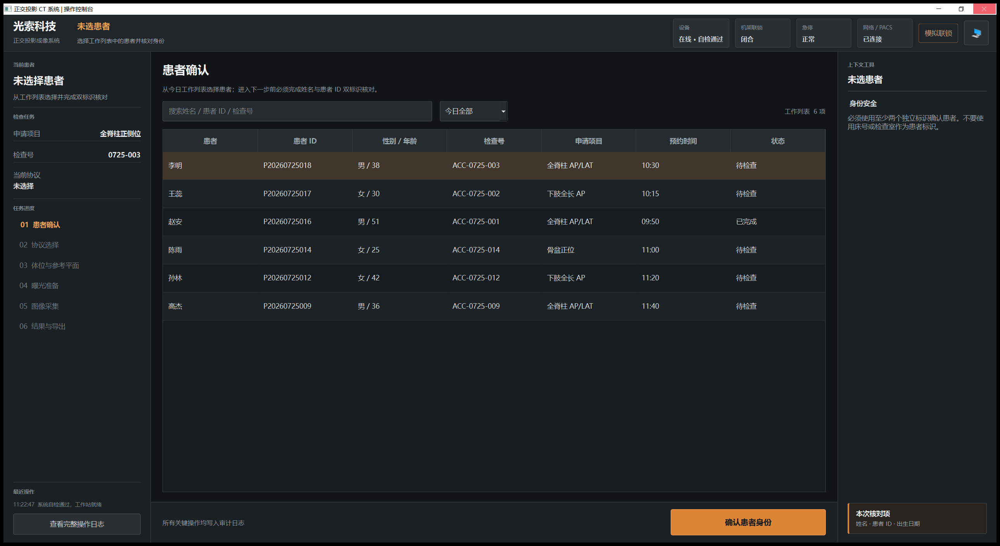

# 光索科技正交投影 CT 控制台 UI 原型

Qt Widgets interaction prototype for an orthogonal-projection CT workstation. The UI uses one state-driven workspace instead of three independent mode pages:

- patient identity confirmation and protocol locking;
- positioning, readiness checks, exposure confirmation, and acquisition monitoring;
- image review with grouped viewing, measurement, annotation, and export tools;
- simulated device interlock and locked recovery state.

See [DESIGN_SPEC.md](DESIGN_SPEC.md) for the information architecture, state model, safety constraints, color tokens, Qt mapping, and frontend handoff notes.

All patient, device, dose, image, DICOM, and audit data in this prototype is simulated. It is not clinical software.

## Preview



## Build

Qt 5 or Qt 6 with the Widgets module is supported.

```powershell
cmake -S . -B build
cmake --build build --config Release --parallel
```

With a multi-configuration generator on Windows, the executable is generated at:

```text
build/Release/EOS_UI.exe
```
